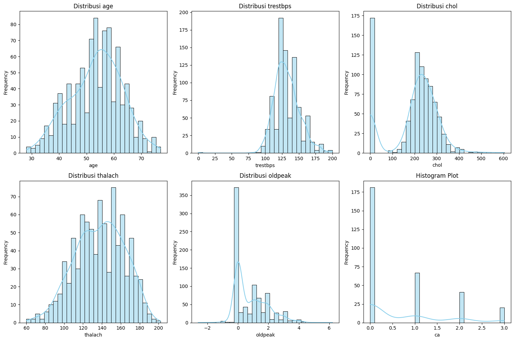
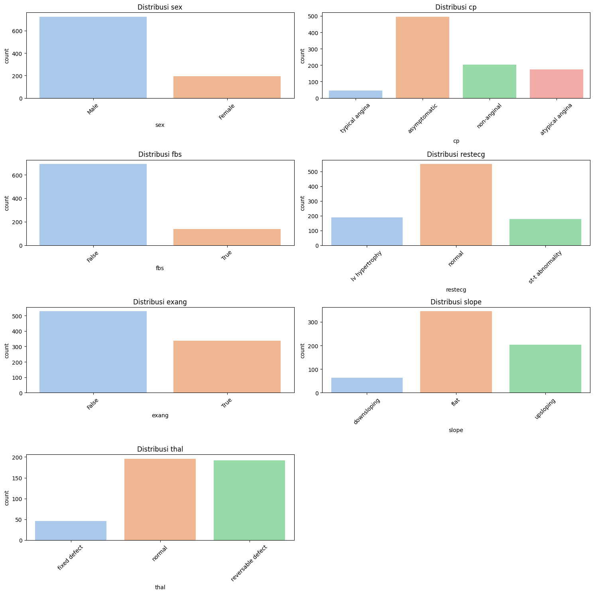
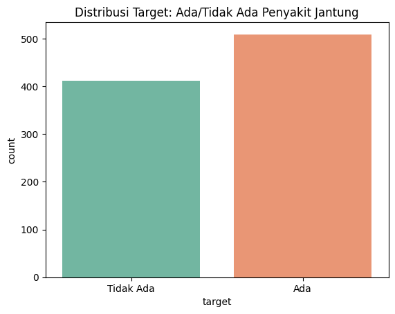
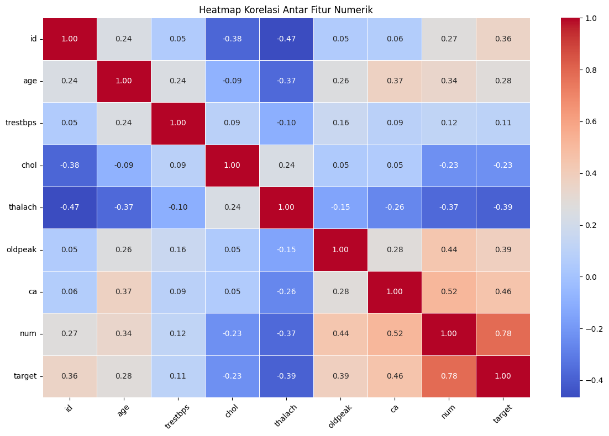

# Laporan Proyek Machine Learning - Laila Rohmatul I'zzah

## Domain Proyek

Penyakit jantung dan pembuluh darah atau yang dikenal sebagai penyakit kardiovaskular, kini menjadi salah satu ancaman utama bagi kesehatan global, khususnya dalam kelompok Penyakit Tidak Menular (PTM). Di Indonesia, gangguan kardiovaskular tercatat sebagai penyebab kematian tertinggi berdasarkan hasil studi kohort PTM selama periode 2011 hingga 2021. Menurut laporan dari World Health Organization (WHO), lebih dari 17 juta orang di seluruh dunia kehilangan nyawa setiap tahunnya akibat penyakit ini. Di Indonesia sendiri, jumlah kematian tahunan akibat penyakit kardiovaskular diperkirakan mencapai 651.481 jiwa, dengan stroke menyumbang 331.349 kasus, penyakit jantung koroner 245.343 kasus, dan jantung akibat hipertensi sebanyak 50.620 kasus.

Laporan Global Status Report on Noncommunicable Diseases (NCD) 2019 yang dirilis oleh IHME menunjukkan bahwa penyakit jantung menyumbang 1 dari 3 kematian di dunia. Banyaknya kasus kematian tersebut membuat penyakit jantung menjadi salah satu perhatian Pemerintah Republik Indonesia untuk melakukan penanganan dan pencegahan terhadap penyakit tidak menular tersebut. Berdasarkan penelitian yang dilakukan oleh Hidayat et al. (2024), banyak faktor yang dapat memprediksi seseorang memiliki penyakit jantung, salah satu faktor utamanya adalah hipertensi. Selain itu, beberapa faktor seperti pola makan tinggi karbohidrat dan lemak, aktivitas fisik rendah, dan merokok juga dapat menjadi faktor tambahan untuk mengetahui seberapa besar risiko terhadap penyakit jantung.

Diagnosis penyakit jantung sendiri umumnya dilakukan melalui serangkaian tes klinis yang memerlukan waktu, biaya, dan tenaga medis yang terbatas. Dengan perkembangan teknologi, machine learning (ML) menjadi pendekatan potensial untuk membantu proses diagnosis dini berbasis data medis pasien. Model klasifikasi berbasis ML dapat dilatih untuk mengenali pola dari data seperti tekanan darah, kolesterol, usia, dan riwayat medis lainnya, guna memprediksi apakah seseorang berisiko terkena penyakit jantung.

Penerapan model prediktif ini penting karena:
- Membantu dokter dalam mengambil keputusan awal sebelum pemeriksaan lanjutan
- Meningkatkan efisiensi proses skrining massal di fasilitas kesehatan
- Menyediakan sistem peringatan dini untuk pasien yang tidak menyadari gejala

Dengan menggunakan dataset Heart Disease UCI yang telah banyak digunakan untuk penelitian prediktif medis, proyek ini bertujuan untuk membangun sistem klasifikasi yang mampu memprediksi risiko penyakit jantung secara akurat.

**Referensi**

World Health Organization. (2021). Cardiovascular diseases (CVDs). https://www.who.int/news-room/fact-sheets/detail/cardiovascular-diseases-(cvds)

Kementerian Kesehatan Republik Indonesia. (2018). Laporan Riskesdas 2018. Badan Penelitian dan Pengembangan Kesehatan.

Hidayat, R., Wahyuni, S., & Susanti, E. (2024). Prediksi penyakit jantung menggunakan algoritma support vector machine (SVM). BIOS: Jurnal Ilmiah Biologi, 5(2), 83–90. https://doi.org/10.37148/bios.v5i2.152

Redwankarimsony. (2023). Heart Disease Data [Data set]. Kaggle. https://www.kaggle.com/datasets/redwankarimsony/heart-disease-data

## Business Understanding

### Problem Statements

- Bagaimana memanfaatkan data rekam medis sederhana untuk memprediksi kemungkinan seseorang mengidap penyakit jantung?
- Apakah model machine learning dapat membantu proses diagnosis penyakit jantung secara otomatis dan efisien?
- Algoritma machine learning mana yang paling optimal dalam memberikan prediksi risiko penyakit jantung pada dataset yang tersedia?

### Goals

- Membangun model prediktif berbasis machine learning yang mampu mendeteksi kemungkinan seseorang mengidap penyakit jantung berdasarkan data klinis.
- Menyediakan sistem prediksi yang cepat, murah, dan akurat untuk mendukung diagnosis awal penyakit jantung.
- Mengevaluasi dan membandingkan beberapa algoritma machine learning untuk mendapatkan model terbaik dengan performa optimal.

### Solution statements ###

- Membangun model baseline menggunakan algoritma KNN karena algoritma ini relatif sederhana dibandingkan dengan algoritma lain, serta bisa digunakan untuk klasifikasi sebagaimana dalam proyek ini.
- Membandingkan performa model baseline dengan algoritma lain seperti Random Forest dan XGBoost, yang dikenal memiliki kemampuan tinggi dalam menangani dataset tabular dan klasifikasi kompleks.
- Menggunakan metrik evaluasi seperti Confussion Metrix, Accuracy, Precision, Recall, dan F1-Score untuk mengukur performa setiap model secara objektif.

## Data Understanding
Dataset yang digunakan berasal dari [Kaggle - Heart Disease Dataset](https://www.kaggle.com/datasets/redwankarimsony/heart-disease-data). Dataset ini merupakan subset dari Cleveland Heart Disease Database, yang merupakan salah satu referensi paling umum dalam penelitian machine learning untuk prediksi penyakit jantung.

Dataset ini merupakan tipe multivariat (multivariate dataset), artinya terdiri dari banyak variabel numerik dan kategorikal yang digunakan untuk analisis. Tujuan utamanya adalah untuk memprediksi kemungkinan seseorang mengidap penyakit jantung berdasarkan data rekam medis mereka.

### Variabel-variabel pada Heart Disease Dataset adalah sebagai berikut:
#### Jumlah Data
- Jumlah fitur: 16 fitur (15 fitur utama + 1 target)
- Jumlah data (rows): 920 
#### Fitur-fitur dalam Dataset
Berikut ini adalah penjelasan dari fitur-fitur yang digunakan:
1. id: ID unik untuk setiap pasien
2. age: Usia pasien (dalam tahun)
3. dataset: Lokasi asal data dikumpulkan
4. sex: Jenis kelamin (Male/Female)
5. cp: Jenis nyeri dada (typical angina, atypical angina, non-anginal, asymptomatic)
6. trestbps: Tekanan darah saat istirahat (mm Hg)
7. chol: Kadar kolesterol dalam darah (mg/dl)
8. fbs: Kadar gula darah puasa > 120 mg/dl (1 = ya, 0 = tidak)
9. restecg: Hasil elektrokardiografi saat istirahat (normal, stt abnormality, lv hypertrophy)
10. thalach: Detak jantung maksimum yang dicapai
11. exang: Angina akibat olahraga (1 = ya, 0 = tidak)
12. oldpeak: Depresi ST akibat latihan dibandingkan kondisi istirahat
13. slope: Kemiringan segmen ST saat puncak latihan
14. ca: Jumlah pembuluh darah besar yang terlihat dalam fluoroskopi (0–3)
15. thal: Hasil tes Thalassemia (normal, fixed defect, reversible defect)
16. num: Target (0 = tidak ada penyakit jantung, 1 = ada penyakit jantung)


### Exploratory Data Analysis
#### Informasi Dataset

- Terdapat 8 kolom dengan tipe object, yaitu: sex, dataset, cp, fbs, restecg, exang, slope, dan thal. Kolom ini merupakan categorical features (fitur non-numerik).
- Terdapat 5 kolom numerik dengan tipe data float64 yaitu: trestbps, chol, thalch, oldpeak, dan ca. Ini merupakan fitur numerik yang merupakan hasil pengukuran secara fisik.
- Terdapat 3 kolom numerik dengan tipe data int64, yaitu: id, age, dan num. Kolom 'num' merupakan target fitur.

#### Deteksi Missing Values

Ada perbedaan jumlah data pada kolom *trestbps, chol, fbs, restecg, thalch, exang, oldpeak, slope, ca,* dan *thal*. Hal ini menunjukkan adanya missing values pada kolom tersebut. 

#### Deteksi Data Duplikat

Pada data ini tidak ditemukan data yang duplikat

### Visualisasi Data



- age: Terdistribusi normal dengan puncak sekitar usia 55 tahun. Artinya, mayoritas pasien berusia menengah hingga tua.
- trestbps (tekanan darah saat istirahat): Terdistribusi miring ke kanan (right-skewed), dengan banyak pasien memiliki tekanan darah sekitar 120 mmHg.
- chol (kolesterol): Sangat miring ke kanan, dengan beberapa outlier ekstrem. Ini menunjukkan banyak pasien dengan kadar kolesterol tinggi.
- thalach (denyut jantung maksimum): Terdistribusi agak normal, puncaknya sekitar 140 bpm.
- oldpeak (ST depression): Banyak nilai nol, menunjukkan sebagian besar pasien tidak menunjukkan depresi ST saat uji stres. Tapi ada ekor kanan (right-skewed).



- sex: Mayoritas pasien adalah laki-laki.
- cp (chest pain): Jenis asymptomatic paling dominan.
- fbs (fasting blood sugar): Sebagian besar pasien memiliki kadar gula < 120 mg/dl (False).
- restecg: Mayoritas hasil ECG adalah normal.
- exang (angina yang dipicu olahraga): Lebih banyak pasien tidak mengalami exercise-induced angina.
- slope: Bentuk slope ST flat paling banyak.
- thal: Terdistribusi hampir seimbang antara normal dan reversible defect, lebih sedikit fixed defect



Terdapat sedikit ketidakseimbangan pada distribusi target, di mana kelas "Ada" penyakit jantung lebih banyak dibanding "Tidak Ada". Namun, karena perbedaan proporsinya tidak terlalu signifikan (~55% vs 45%), maka metrik evaluasi seperti akurasi, precision, recall, dan F1-score tetap relevan tanpa perlu menerapkan teknik penyeimbangan kelas.



Heatmap korelasi ini menunjukkan hubungan antar fitur numerik dalam dataset. Ditemukan bahwa fitur num memiliki korelasi sangat tinggi dengan target (0.78), mengindikasikan bahwa target merupakan bentuk transformasi dari num. Fitur lain yang memiliki korelasi positif cukup kuat terhadap target adalah ca (0.46) dan oldpeak (0.39). Sebaliknya, fitur thalach memiliki korelasi negatif yang cukup kuat (-0.39), yang menunjukkan bahwa semakin tinggi detak jantung maksimal pasien, kemungkinan terkena penyakit jantung cenderung lebih rendah. Korelasi antar fitur seperti antara age dan thalach (-0.37) juga memberi informasi tambahan mengenai pola data yang dapat berguna dalam proses pemodelan selanjutnya.

## Data Preparation
### 1. Mengatasi Missing Values

berikut beberapa tahapan yang dilakukan untuk mengatasi missing values dalam data:

#### - Imputasi Nilai Hilang pada Fitur Numerik

Fitur numerik seperti trestbps, chol, thalach, dan oldpeak mengandung nilai kosong. Untuk menjaga distribusi data tetap representatif dan menghindari distorsi akibat nilai ekstrem, dilakukan imputasi menggunakan nilai median. Median dipilih karena lebih robust terhadap outlier dibandingkan mean.

#### - Imputasi Nilai Hilang pada Fitur Kategorikal

Untuk fitur kategorikal seperti fbs, restecg, exang, slope, dan thal, nilai kosong diisi menggunakan modus (nilai yang paling sering muncul). Pemilihan modus bertujuan mempertahankan karakter dominan dari kategori tersebut agar distribusi data tidak berubah signifikan.

#### - Menghapus Fitur ca

Fitur ca dihapus karena memiliki terlalu banyak nilai kosong sehingga dapat mengganggu analisis dan berpotensi menurunkan kualitas model. Daripada melakukan imputasi yang bisa menghasilkan bias, penghapusan fitur ini dinilai lebih bijak.

#### - Pemeriksaan Nilai Hilang

Setelah dilakukan imputasi dan penghapusan fitur bermasalah, dilakukan pengecekan ulang terhadap seluruh kolom untuk memastikan bahwa tidak ada nilai yang hilang tersisa di dataset.

### 2. Encoding Variabel Kategorik

Encoding dilakukan untuk mengubah fitur kategorikal menjadi numerik, karena algoritma machine learning tidak dapat memproses data bertipe string secara langsung. Berdasarkan dataset, kolom-kolom seperti `sex`, `cp`, `fbs`, `restecg`, `exang`, `slope`, `thal`, dan `dataset` merupakan fitur kategorikal yang perlu dikodekan.

**Teknik yang digunakan:**

- **One-Hot Encoding**  
  Menggunakan `pd.get_dummies()` dengan opsi `drop_first=True` untuk menghindari multikolinearitas antar fitur hasil encoding.

- **Konversi Boolean ke Integer**  
  Kolom hasil encoding bertipe boolean diubah ke tipe integer (`True/False` → `1/0`) agar lebih seragam untuk proses training model.

Langkah ini sangat penting untuk memastikan semua fitur berada dalam format numerik yang sesuai dengan kebutuhan model machine learning.
 

### 3. Standarisasi Fitur Numerik

Standarisasi dilakukan untuk menyamakan skala antar fitur numerik, terutama karena beberapa algoritma seperti **K-Nearest Neighbor (KNN)** sangat sensitif terhadap perbedaan skala. 

Dalam dataset ini, fitur numerik seperti `age`, `trestbps`, `chol`, `thalach`, dan `oldpeak` memiliki rentang nilai yang berbeda. Jika tidak distandarisasi, fitur dengan skala besar dapat mendominasi proses pembelajaran.

**Metode yang digunakan:**
- `StandardScaler` dari `sklearn.preprocessing`  
  Mengubah distribusi fitur menjadi memiliki **mean = 0** dan **standard deviation = 1** (standar Z-score).

```python
from sklearn.preprocessing import StandardScaler

scaler = StandardScaler()
numerical_cols = ['age', 'trestbps', 'chol', 'thalach', 'oldpeak']
heart_encoded[numerical_cols] = scaler.fit_transform(heart_encoded[numerical_cols])
```
### 4. Penyesuaian Nama Kolom

Dilakukan penggantian nama kolom dari `thalch` menjadi `thalach` untuk konsistensi penamaan dan kemudahan pembacaan, karena kolom ini merepresentasikan *maximum heart rate achieved*.

### 5. Penentuan Variabel Target

Kolom `num` digunakan sebagai variabel target karena berisi label biner:
- `0` menandakan pasien tidak memiliki penyakit jantung,
- `1` menandakan pasien memiliki penyakit jantung.

Tidak diperlukan proses encoding tambahan karena kolom ini sudah dalam bentuk numerik biner.

### 6. Data Spliting
 
Dataset dibagi menjadi data latih (80%) dan data uji (20%) menggunakan fungsi `train_test_split`.

## Modeling

### 1. Pemilihan Algoritma 

Pada proyek ini digunakan 3 algoritma klasifikasi untuk memprediksi risiko penyakit jantung, yaitu:

1. K-Nearest Neighbors (KNN)
2. Random Forest Classifier
3. Extreme Gradient Boosting (XGBoost)

Pemilihan ketiga algoritma tersebut dilakukan untuk membandingkan performa masing-masing model dan menentukan algoritma terbaik dalam menyelesaikan permasalahan klasifikasi risiko penyakit jantung.

### 2. Tahapan Modeling

#### 1. K-Nearest Neighbor (KNN)

KNN adalah algoritma non-parametrik yang bekerja dengan mencari `k` tetangga terdekat dari suatu data untuk menentukan kelasnya.

**Parameter:**
- `n_neighbors=5`: Menggunakan 5 tetangga terdekat untuk klasifikasi.

**Proses:**
1. Model dilatih menggunakan `X_train` dan `y_train`.
2. Prediksi dilakukan pada `X_test`.
3. Evaluasi menggunakan:
   - Classification Report
   - Akurasi
   - Confusion Matrix

```python
knn = KNeighborsClassifier(n_neighbors=5)
knn.fit(X_train, y_train)
y_pred_knn = knn.predict(X_test)

```

#### 2. Random Forest

Random Forest adalah algoritma ensemble berbasis decision tree yang membangun banyak pohon keputusan dan menggabungkan hasilnya untuk meningkatkan akurasi dan mengurangi overfitting.

**Parameter:**
- `n_estimators=100`: Jumlah tree.
- `random_state=42`: Seed untuk hasil yang konsisten.

**Proses:**
1. Model dilatih menggunakan `X_train` dan `y_train`.
2. Prediksi dilakukan pada `X_test`.
3. Evaluasi menggunakan:
   - Classification Report
   - Akurasi
   - Confusion Matrix

```python
rf = RandomForestClassifier(n_estimators=100, random_state=42)
rf.fit(X_train, y_train)
y_pred_rf = rf.predict(X_test)
```

#### 3. XGBoost

XGBoost adalah algoritma boosting yang efisien dan akurat, dirancang untuk performa tinggi pada dataset besar.

**Parameter:**
- `use_label_encoder=False`: Menonaktifkan label encoder bawaan.
- `eval_metric='logloss'`: Metrik evaluasi yang digunakan selama pelatihan.
- `random_state=42`: Seed untuk replikasi hasil.

**Proses:**
1. Model dilatih menggunakan `X_train` dan `y_train`.
2. Prediksi dilakukan pada `X_test`.
3. Evaluasi menggunakan:
   - Classification Report
   - Akurasi
   - Confusion Matrix

```python
xgb = XGBClassifier(use_label_encoder=False, eval_metric='logloss', random_state=42)
xgb.fit(X_train, y_train)
y_pred_xgb = xgb.predict(X_test)
```

**NOTE: Prediksi & Evaluasi**  
Digunakan `classification_report` untuk menghitung metrik evaluasi: akurasi, precision, recall, dan f1-score.

### 3. Kelebihan dan Kekurangan Algoritma

Berikut ini adalah kelebihan dan kekurangan dari masing-masing algoritma yang digunakan dalam pemodelan:

#### 1. K-Nearest Neighbor (KNN)
- **Kelebihan:**
  - Mudah dipahami dan diimplementasikan.
  - Tidak membuat asumsi tentang distribusi data.

- **Kekurangan:**
  - Sangat sensitif terhadap skala fitur (dapat diatasi dengan standardisasi).
  - Tidak optimal untuk data dengan banyak noise atau outlier.
  - Tidak dapat menangani data kosong (*missing values*).

#### 2. Random Forest
- **Kelebihan:**
  - Cocok untuk data tabular seperti dataset ini.
  - Tidak memerlukan proses scaling atau normalisasi.
  - Tahan terhadap outlier dan *missing value* (hingga batas tertentu).
  - Memberikan insight berupa *feature importance*.

- **Kekurangan:**
  - Komputasi bisa menjadi berat jika jumlah *tree* sangat banyak.

#### 3. XGBoost
- **Kelebihan:**
  - Performa tinggi untuk klasifikasi data tabular.
  - Mampu menangani data imbalance, *missing value*, dan outlier dengan baik.
  - Mendukung banyak opsi *tuning* untuk optimasi akurasi.

- **Kekurangan:**
  - Proses *tuning* lebih kompleks (learning rate, estimators, max depth, dll.).
  - Interpretasi model lebih rumit dibandingkan Random Forest.

### 4. Model Terbaik

  Berdasarkan hasil evaluasi, diperoleh model terbaik adalah **Random Forest** karena memiliki akurasi tertinggi sebesar 89,1%. Selain itu, algoritma ini juga memiliki F1-score tertinggi di kedua kelas (0 dan 1), serta memiliki keseimbangan precision dan recall yang sangat baik. 

## Evaluation

Evaluasi dilakukan menggunakan **confusion matrix**, yaitu tabel klasifikasi berdasarkan 4 nilai utama:

- **TP (True Positive)**: Prediksi positif yang benar.
- **TN (True Negative)**: Prediksi negatif yang benar.
- **FP (False Positive)**: Prediksi positif yang salah.
- **FN (False Negative)**: Prediksi negatif yang salah.

|              | Predicted Positive | Predicted Negative |
|--------------|--------------------|--------------------|
| **Actual Positive** | True Positive (TP)     | False Negative (FN)    |
| **Actual Negative** | False Positive (FP)    | True Negative (TN)     |


### 1. Metrik Evaluasi yang Digunakan

Metrik evaluasi klasifikasi digunakan untuk menilai kinerja model saat mengklasifikasikan data ke dalam kategori tertentu. Metrik evaluasi yang digunakan pada projek ini antara lain:

#### 1. Accuracy

Accuracy merupakan metrik paling sederhana untuk mengukur kinerja model klasifikasi. Akurasi dihitung sebagai proporsi prediksi benar (baik positif maupun negatif) terhadap seluruh prediksi yang dilakukan oleh model.

$$
\text{Accuracy} = \frac{TP + TN}{TP + TN + FP + FN}
$$

#### 2. Precision

Precision mengukur seberapa baik model dalam menghindari positif palsu atau *false positives*.

$$
\text{Precision} = \frac{TP}{TP + FP}
$$

#### 3. Recall

Recall adalah metrik yang mengukur seberapa baik model dapat menangkap semua contoh positif. Ini adalah rasio prediksi positif yang benar terhadap semua kasus positif yang sebenarnya ada dalam data.

$$
\text{Recall} = \frac{TP}{TP + FN}
$$

#### 4. F1-Score

F1-Score adalah metrik yang menggabungkan presisi dan recall menjadi satu nilai tunggal yang mempertimbangkan keduanya. F1-Score adalah rata-rata harmonis dari presisi dan recall, memberikan gambaran yang lebih baik ketika ada trade-off antara keduanya.

$$
\text{F1-Score} = 2 \cdot \frac{\text{Precision} \cdot \text{Recall}}{\text{Precision} + \text{Recall}}
$$

### 3. Hasil Evaluasi Model

| Model               | Accuracy | Precision (0) | Precision (1) | Recall (0) | Recall (1) | F1-Score (0) | F1-Score (1) |
|---------------------|----------|---------------|---------------|------------|------------|--------------|--------------|
| K-Nearest Neighbor  | 0.85    | 0.83         | 0.86          | 0.79       | 0.89       | 0.81         | 0.87         |
| Random Forest       | 0.87    | 0.83          | 0.90          | 0.85       | 0.88       | 0.84         | 0.89         |
| XGBoost             | 0.86    | 0.82          | 0.89          | 0.84       | 0.87       | 0.83         | 0.88         |

### Confusion Matrix

| Model               | Confusion Matrix       |
|---------------------|------------------------|
| K-Nearest Neighbor  | `[[59, 16], [12, 97]]` |
| Random Forest       | `[[64, 11], [13, 96]]` |
| XGBoost             | `[[63, 12], [14, 95]]` |

> Format: `[[TN, FP], [FN, TP]]`

### 4. Analisis

**K-Nearest Neighbor (KNN)**

Model ini memiliki akurasi sebesar 85%. Precision untuk kelas 0 sebesar 0.83 dan kelas 1 sebesar 0.86, sedangkan recall-nya masing-masing 0.79 (kelas 0) dan 0.89 (kelas 1). Meskipun performanya cukup baik untuk kelas 1, KNN masih kurang optimal dalam mengenali kelas 0, terbukti dari 16 data kelas 0 yang salah diklasifikasikan sebagai kelas 1. F1-score keseluruhan tetap stabil di angka 0.81, namun masih ada ruang untuk perbaikan terutama dalam mengurangi kesalahan klasifikasi pada kelas 0.

**Random Forest**

Model ini memberikan hasil terbaik secara keseluruhan dengan akurasi 87%, precision tinggi (0.83 untuk kelas 0 dan 0.90 untuk kelas 1), serta recall yang cukup seimbang (0.85 dan 0.88). Confusion matrix menunjukkan hanya 11 data kelas 0 dan 13 data kelas 1 yang salah prediksi. F1-score tinggi untuk kedua kelas (0.84 dan 0.89) menunjukkan performa yang kuat dan konsisten, baik dalam mengidentifikasi kelas negatif maupun positif.

**XGBoost**

Memiliki akurasi 86%, menjadikannya model kompetitif dengan Random Forest. Precision dan recall masing-masing 0.82 dan 0.84 untuk kelas 0, serta 0.89 dan 0.87 untuk kelas 1. Confusion matrix menunjukkan 12 kesalahan klasifikasi pada kelas 0 dan 14 pada kelas 1. F1-score juga tinggi (0.83 dan 0.88), sehingga model ini bisa menjadi alternatif yang baik jika dilakukan tuning lebih lanjut.

### 5. Kesimpulan
Berdasarkan hasil evaluasi, **Random Forest** adalah model dengan performa terbaik pada dataset ini, dengan akurasi tertinggi (87%), serta precision dan recall yang sangat baik dan seimbang. XGBoost juga layak dipertimbangkan karena performanya hampir sebanding, hanya sedikit di bawah Random Forest dalam hal akurasi dan ketepatan. Sementara itu, KNN menunjukkan performa cukup baik, namun masih menghasilkan lebih banyak kesalahan klasifikasi pada kelas 0, sehingga kurang ideal jika dibandingkan dengan dua model lainnya tanpa tuning tambahan.
